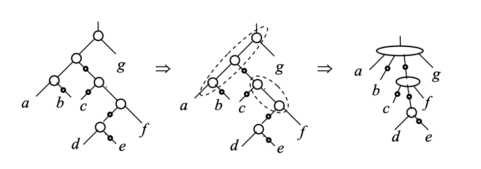
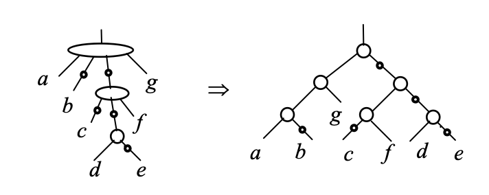
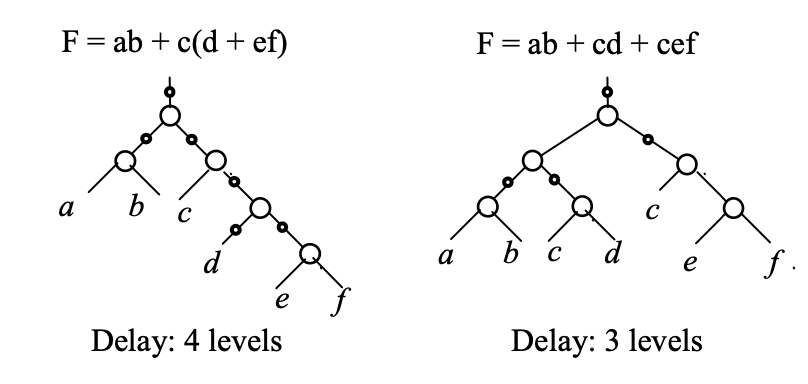
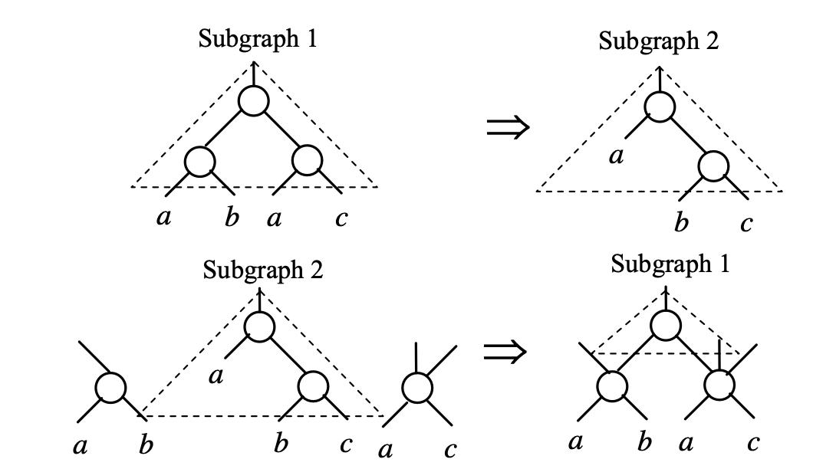

# Documentation
Student: Shangkun LI
Student ID: 20307130125
Department of Physics

Repository: https://github.com/ShangkunLi/Logic_Synthesis_phyLS.git

本Project主要通过调用phyLS逻辑综合框架进行逻辑综合。

## 目录

## 1 项目说明
### 1.1 功能说明
本项目利用phyLS提供的逻辑综合工具代码框架，完善其中的balance和rewrite功能。然后利用该工具对10个benchmarks进行逻辑综合，并记录结果。

### 1.2 文件结构
```
Logic_Synthesis_phyLS   # 项目文件夹
├── phyLS   # 子项目文件夹（phyLS文件夹）
│   ├── benchmarks  # 测试用例
│   ├── build   # 编译文件夹
│   ├── CMakeLists.txt  # CMake文件，用于生成Makefile
│   ├── docs    # Documentation
│   ├── lib # 依赖的library
│   ├── LICENSE
│   ├── README.md   # 说明文档
│   └── src # 源文件
└── README.md   # 说明文档（本文）
```

## 2 代码说明
本项目主要基于已有的phyLS架构实现了balance和rewrite的功能。该部分可分为两部分构成：
1. 介绍balance算法的实现思路
2. 介绍rewrite算法的实现思路

### 2.1 Balance算法实现思路
在逻辑综合优化中，我们常常使用AIG来表示逻辑电路，从而简化优化流程的目的。所谓AIG，是指And-Invertor Graph， 是由二输入与门和反相器组合成的简单逻辑单元。
1. AND-Balance
   
    Balance按照拓扑顺序应用，并选择多输入与门的最小延迟树分解。
    利用AND-Balance算法时，balancing分两步，covering和tree-balancing。

    其中covering将子集之间没有反相器且没有外部扇出的两输入与门组合在一起形成一个多输入与门：
    
    

    Tree-balancing将covering得到的多输入与门分解为两输入与门，试图减少AIG的深度：

        

2. SOP-Balance for Small AIG：
   
   在规模较小的AIG图（输入变量数<10）中，我们可以根据真值表计算出逻辑函数，并将逻辑函数用SOP（Sum of Products）表示出来。随后对SOP表示形式的AIG图应用AND-Balance算法，就可以实现balance。

   如下图所示，我们可以将逻辑电路从4层减少到3层.

   


3. SOP-Balance for Large AIG:

    实际的AIG往往规模很大，这就不能用SOP的方式实现balancing。
    
    但我们可以通过将整个AIG划分为多个区域，对于每个区域使用SOP-Balance算法的方式实现balancing。这也是本Project中使用的方法。

    本Project中通过`foreach_co()`函数对每个Node实现遍历，并通过`balance_rec()`对每个Node的对应的割集进行SOP-Balance。

在phyLS中的算法调用代码请见`phyLS/src/core/balance.hpp`

### 2.2 Rewrite算法实现思路
Rewrite过程中是指通过执行AIG的重写过程，实现AIG节点数的减少和逻辑层级的减少。

具体过程中，我们首先对每一个割集的子图进行遍历，每一个子图都隶属于某一个NPN等价类，将该子图的等价类记录下来。

如果某一子图可以被同一等价类中的某一个子图替换掉，则将该子图的引用数减1，直到该子图的引用数减为0，将该子图移除。同时，如果有新的子图加入，则需要考虑新加入子图的开销。移除旧子图获得的收益减去新加入子图的开销，就是总的收益。如此对所有子图进行遍历，将保留总收益最大的替换操作即可实现rewrite。

在phyLS中的算法调用代码请见`phyLS/src/core/rewrite.hpp`

其中关于AIG的子图库的选择有多种，我们在此提供了两种选择，并用Complete AIG Database实现本实验。

示例如图所示。




## 3 编译及结果

### 3.1 编译
从远程仓库下载源代码
```
git clone https://github.com/ShangkunLi/Logic_Synthesis_phyLS.git --recurse-submodules
```

创建编译目标文件夹
```
cd phyLS
mkdir build && cd build
```

进行编译
```
cmake ..
make
```

执行程序
```
./bin/phyLS
```
### 3.2 结果
对20个benchmarks分别进行测试，分别记录其优化前和进行balancing、rewriting优化后的相关结果。

其中将优化后相关指标有所改善的指标用红色字体标记出来。


<style type="text/css">
.tg  {border-collapse:collapse;border-spacing:0;}
.tg td{border-color:black;border-style:solid;border-width:1px;font-family:Arial, sans-serif;font-size:14px;
  overflow:hidden;padding:10px 5px;word-break:normal;}
.tg th{border-color:black;border-style:solid;border-width:1px;font-family:Arial, sans-serif;font-size:14px;
  font-weight:normal;overflow:hidden;padding:10px 5px;word-break:normal;}
.tg .tg-baqh{text-align:center;vertical-align:top}
.tg .tg-nrix{text-align:center;vertical-align:middle}
.tg .tg-9ewa{color:#fe0000;text-align:center;vertical-align:top}
</style>
<table class="tg"><thead>
  <tr>
    <td class="tg-baqh">优化前/后</td>
    <td class="tg-baqh">i/o</td>
    <td class="tg-baqh">gates</td>
    <td class="tg-baqh">level</td>
    <td class="tg-nrix" rowspan="21">After tech mapping</td>
    <td class="tg-baqh">#gates</td>
    <td class="tg-baqh">area</td>
    <td class="tg-baqh">delay</td>
  </tr>
  <tr>
    <td class="tg-baqh">adder</td>
    <td class="tg-baqh">256/129</td>
    <td class="tg-baqh">1020/1020</td>
    <td class="tg-baqh">255/255</td>
    <td class="tg-baqh">639/639</td>
    <td class="tg-baqh">1849/1849</td>
    <td class="tg-baqh">204.9/204.9</td>
  </tr>
  <tr>
    <td class="tg-baqh">arbiter</td>
    <td class="tg-baqh">256/129</td>
    <td class="tg-baqh">11839/11839</td>
    <td class="tg-baqh">87/87</td>
    <td class="tg-baqh">6678/6678</td>
    <td class="tg-baqh">18773/18773</td>
    <td class="tg-baqh">70.7/70.7</td>
  </tr>
  <tr>
    <td class="tg-baqh">bar</td>
    <td class="tg-baqh">135/128</td>
    <td class="tg-9ewa">3336/3141</td>
    <td class="tg-baqh">12/12</td>
    <td class="tg-9ewa">2319/2161</td>
    <td class="tg-9ewa">5911/5693</td>
    <td class="tg-baqh">10.2/10.9</td>
  </tr>
  <tr>
    <td class="tg-baqh">cavlc</td>
    <td class="tg-baqh">10/11</td>
    <td class="tg-9ewa">693/687</td>
    <td class="tg-baqh">16/16</td>
    <td class="tg-9ewa">485/483</td>
    <td class="tg-baqh">1212/1218</td>
    <td class="tg-9ewa">14.3/14.1</td>
  </tr>
  <tr>
    <td class="tg-baqh">ctrl</td>
    <td class="tg-baqh">7/26</td>
    <td class="tg-9ewa">174/146</td>
    <td class="tg-baqh">10/10</td>
    <td class="tg-9ewa">113/110</td>
    <td class="tg-9ewa">275/265</td>
    <td class="tg-9ewa">8.3/7.9</td>
  </tr>
  <tr>
    <td class="tg-baqh">dec</td>
    <td class="tg-baqh">8/256</td>
    <td class="tg-baqh">304/304</td>
    <td class="tg-baqh">3/3</td>
    <td class="tg-baqh">296/296</td>
    <td class="tg-baqh">648/648</td>
    <td class="tg-baqh">3.7/3.7</td>
  </tr>
  <tr>
    <td class="tg-baqh">div</td>
    <td class="tg-baqh">128/128</td>
    <td class="tg-9ewa">57247/41933</td>
    <td class="tg-baqh">4372/4406</td>
    <td class="tg-9ewa">55376/40950</td>
    <td class="tg-9ewa">127233/99321</td>
    <td class="tg-9ewa">3516.5/3442.3</td>
  </tr>
  <tr>
    <td class="tg-baqh">hyp</td>
    <td class="tg-baqh">256/128</td>
    <td class="tg-9ewa">214335/212833</td>
    <td class="tg-baqh">24801/24802</td>
    <td class="tg-baqh">116061/116717</td>
    <td class="tg-baqh">364855/365750</td>
    <td class="tg-9ewa">16771.4/16723.3</td>
  </tr>
  <tr>
    <td class="tg-baqh">i2c</td>
    <td class="tg-baqh">147/142</td>
    <td class="tg-9ewa">1342/1262</td>
    <td class="tg-9ewa">20/16</td>
    <td class="tg-9ewa">1010/986</td>
    <td class="tg-9ewa">2458/2346</td>
    <td class="tg-9ewa">14.6/13.2</td>
  </tr>
  <tr>
    <td class="tg-baqh">int2float</td>
    <td class="tg-baqh">11/7</td>
    <td class="tg-9ewa">260/229</td>
    <td class="tg-9ewa">16/15</td>
    <td class="tg-9ewa">158/154</td>
    <td class="tg-9ewa">429/393</td>
    <td class="tg-baqh">12.9/12.9</td>
  </tr>
  <tr>
    <td class="tg-baqh">log2</td>
    <td class="tg-baqh">32/32</td>
    <td class="tg-9ewa">32060/29901</td>
    <td class="tg-9ewa">444/392</td>
    <td class="tg-baqh">14037/15629</td>
    <td class="tg-baqh">46105/48845</td>
    <td class="tg-9ewa">294.9/273.7</td>
  </tr>
  <tr>
    <td class="tg-baqh">max</td>
    <td class="tg-baqh">512/130</td>
    <td class="tg-baqh">2865/2865</td>
    <td class="tg-9ewa">287/229</td>
    <td class="tg-9ewa">2474/2363</td>
    <td class="tg-9ewa">5650/5386</td>
    <td class="tg-9ewa">205.5/177.8</td>
  </tr>
  <tr>
    <td class="tg-baqh">mem_ctrl</td>
    <td class="tg-baqh">1204/1231</td>
    <td class="tg-9ewa">46836/46701</td>
    <td class="tg-baqh">114/114</td>
    <td class="tg-9ewa">33361/33316</td>
    <td class="tg-9ewa">81657/81466</td>
    <td class="tg-baqh">87.8/87.8</td>
  </tr>
  <tr>
    <td class="tg-baqh">multiplier</td>
    <td class="tg-baqh">128/128</td>
    <td class="tg-9ewa">27062/24760</td>
    <td class="tg-9ewa">274/264</td>
    <td class="tg-baqh">11676/11712</td>
    <td class="tg-9ewa">40751/40296</td>
    <td class="tg-9ewa">209.2/208.8</td>
  </tr>
  <tr>
    <td class="tg-baqh">priority</td>
    <td class="tg-baqh">128/8</td>
    <td class="tg-9ewa">978/832</td>
    <td class="tg-9ewa">250/246</td>
    <td class="tg-9ewa">756/675</td>
    <td class="tg-9ewa">1736/1515</td>
    <td class="tg-9ewa">199.3/197.7</td>
  </tr>
  <tr>
    <td class="tg-baqh">router</td>
    <td class="tg-baqh">60/30</td>
    <td class="tg-9ewa">257/245</td>
    <td class="tg-9ewa">54/27</td>
    <td class="tg-baqh">198/213</td>
    <td class="tg-baqh">527/547</td>
    <td class="tg-9ewa">37.5/20.7</td>
  </tr>
  <tr>
    <td class="tg-baqh">sin</td>
    <td class="tg-baqh">24/25</td>
    <td class="tg-9ewa">5416/5188</td>
    <td class="tg-9ewa">225/183</td>
    <td class="tg-baqh">3387/3518</td>
    <td class="tg-baqh">9462/9883</td>
    <td class="tg-9ewa">149.4/133</td>
  </tr>
  <tr>
    <td class="tg-baqh">sqrt</td>
    <td class="tg-baqh">128/64</td>
    <td class="tg-9ewa">24618/18768</td>
    <td class="tg-baqh">5058/6048</td>
    <td class="tg-9ewa">19211/13827</td>
    <td class="tg-9ewa">44523/35227</td>
    <td class="tg-9ewa">4235.8/4088.2</td>
  </tr>
  <tr>
    <td class="tg-baqh">square</td>
    <td class="tg-baqh">64/128</td>
    <td class="tg-9ewa">18484/17606</td>
    <td class="tg-9ewa">250/249</td>
    <td class="tg-9ewa">9704/9669</td>
    <td class="tg-9ewa">28288/27812</td>
    <td class="tg-9ewa">199.4/199.2</td>
  </tr>
  <tr>
    <td class="tg-baqh">voter</td>
    <td class="tg-baqh">1001/1</td>
    <td class="tg-9ewa">13758/10861</td>
    <td class="tg-9ewa">70/69</td>
    <td class="tg-9ewa">8325/5613</td>
    <td class="tg-9ewa">22807/16929</td>
    <td class="tg-9ewa">53.5/46.2</td>
  </tr></thead></table>